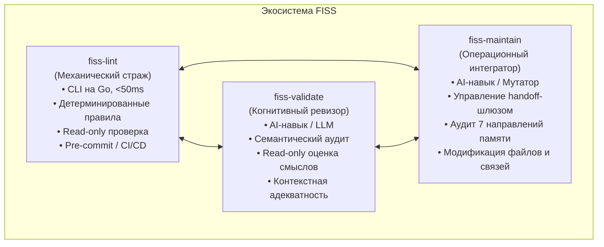
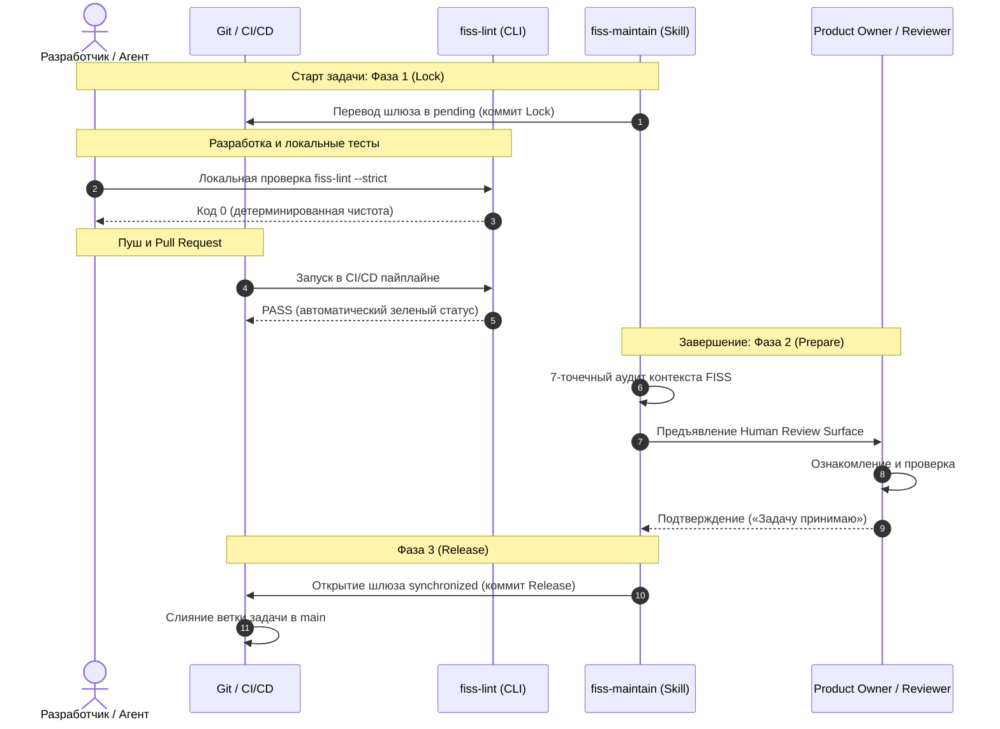

# Экосистемная модель FISS (Триединство инструментов)

Derived from: [BOOTSTRAP](../../BOOTSTRAP.md), [Project Architecture](../../knowledge/project/architecture.md), [README](../../../README.md)

Ментальная модель предназначена для Product Owner и объясняет синергию и строгое разделение обязанностей между компонентами экосистемы стандарта FISS v1.0.0.

---

## 1. Концепция Триединства FISS (The FISS Trinity)

Интеллектуальное пространство FISS спроектировано как живая, постоянно развивающаяся система знаний. Для поддержания её жизнеспособности требуются три принципиально разные роли:

Четвёртым специализированным инструментом жизненного цикла выступает **`fiss-init`** — автономный навык инициализации «0-to-1», создающий пространство с нуля при старте проекта.

---

## 2. Матрица разделения ответственности

| Свойство | `fiss-lint` | `fiss-validate` | `fiss-maintain` | `fiss-init` |
| :--- | :--- | :--- | :--- | :--- |
| **Роль в продукте** | Механический привратник (Gatekeeper). | Когнитивный аудитор качества. | Операционный инженер непрерывности. | Архитектор начальной структуры. |
| **Природа интеллекта** | Детерминированный код (Go). | Языковая модель (LLM). | Языковая модель (LLM) + системные скрипты. | Языковая модель (LLM) + шаблоны. |
| **Режим доступа** | Строго **Read-Only**. | Строго **Read-Only**. | **Read-Write** (мутация файлов, ссылок, handoff). | **Read-Write** (создание пространства с нуля). |
| **Скорость работы** | Миллисекунды (<50ms). | Десятки секунд. | Минуты (в рамках задачи). | Минуты (однократно). |
| **Зависимости** | Zero-dependency (один бинарник). | AI-агентская среда. | AI-агентская среда. | AI-агентская среда. |
| **Основной артефакт** | Текстовый/JSON отчёт об ошибках и код выхода. | Смысловой отчёт соответствия и рекомендации. | Коммиты handoff-шлюза и обновлённое пространство FISS. | Первичное пространство `FISS/`. |

---

## 3. Синергия инструментов на протяжении жизненного цикла задачи

Как инструменты дополняют друг друга в реальном рабочем процессе:

1. **`fiss-lint` экономит ресурсы агента и человека:** Агенту не нужно тратить контекст на ручную проверку ссылок — запуск утилиты мгновенно находит любые опечатки в путях или нарушения отступов `Read when:`.
2. **`fiss-maintain` опирается на `fiss-lint`:** Интегратор знаний запускает `fiss-lint --strict` как непреложное свидетельство (evidence) физической целостности перед тем, как предложить человеку открыть handoff-шлюз.
3. **Человек остаётся владельцем намерений:** Ни один инструмент не принимает решения за человека. Ментальная модель и архитектурные решения утверждаются человеком, а автоматика гарантирует их сохранение.
