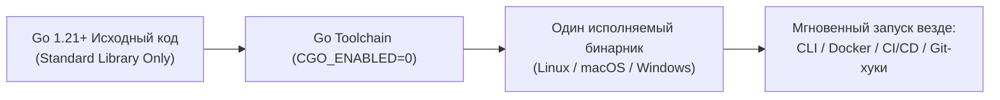
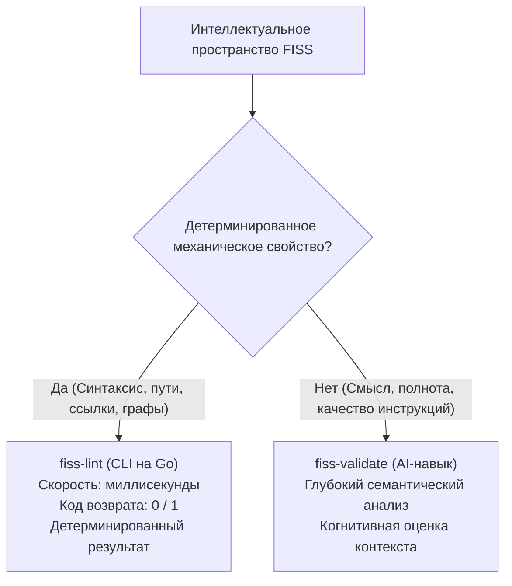

# Концептуальная модель линтера (fiss-lint)

Derived from: [INDEX](../../INDEX.md), [BOOTSTRAP](../../BOOTSTRAP.md), [Project Architecture](../../knowledge/project/architecture.md)

Ментальная модель предназначена для Product Owner и стейкхолдеров проекта, определяя базовую концепцию, ключевые предпосылки, архитектурные компромиссы и границы применимости инструмента `fiss-lint`.

---

## 1. Проблема: Документационная энтропия в эпоху AI

В традиционной разработке документация устаревает медленно, но неотвратимо. При переходе к активной парной разработке с автономными AI-агентами скорость генерации кода и проектных артефактов возрастает на порядки:
- **Размывание контекста:** Агенты создают файлы в произвольных местах, забывают актуализировать ссылки или циклически читают несвязанные каталоги.
- **Хрупкость переходов между задачами:** Новый агент или разработчик, приходя в проект, вынужден тратить контекстное окно и вычислительные ресурсы на поиск актуального состояния.
- **Стандарт FISS как решение:** Стандарт файлового интеллектуального пространства (FISS v1.0.0) вводит строгую организацию проекта (навигационные индексы `INDEX.md`, базовый контекст `BOOTSTRAP.md`, детерминированные условия чтения `Read when:`).

Однако стандарт, который не проверяется автоматически, неизбежно деградирует. Инструмент `fiss-lint` создан как **механический страж стандарта FISS**, предотвращающий деградацию пространства на самых ранних этапах жизненного цикла.

---

## 2. Философия Zero-Dependency и автономности

Один из центральных продуктовых компромиссов `fiss-lint` — абсолютная автономность и независимость от внешнего окружения:

### Почему Zero-Dependency критично для продукта:
1. **Отсутствие тяжелых рантаймов:** Инструмент не требует установки Python, Node.js, Ruby или виртуальных сред. Достаточно одного скомпилированного бинарника.
2. **Мгновенный отклик:** Время полного аудита пространства репозитория составляет от **5 до 30 миллисекунд**. Это делает линтер незаметным при установке в качестве pre-commit или pre-push Git-хука.
3. **Безопасность поставок:** Использование исключительно стандартной библиотеки Go исключает риски цепочки поставок (Supply Chain Attacks) и уязвимостей в сторонних зависимостях.
4. **Кроссплатформенная матрица:** Бинарники собираются под Linux, macOS и Windows для архитектур `amd64` и `arm64`, обеспечивая одинаковый пользовательский опыт во всех средах.

---

## 3. Водораздел: Синтаксический vs. Семантический контроль

Главная концептуальная граница `fiss-lint` — осознанный отказ от попыток решать задачи, требующие искусственного интеллекта или понимания естественного языка:

| Измерение | Механический контроль (`fiss-lint`) | Семантический аудит (`fiss-validate`) |
| :--- | :--- | :--- |
| **Природа проверок** | Строгая математическая/логическая детерминированность. | Вероятностная когнитивная интерпретация смыслов. |
| **Примеры проверок** | Существование файлов, формат `Read when:`, валидность относительных путей, отсутствие сиротских файлов. | Насколько точны инструкции, достаточно ли полон контекст задачи, нет ли понятийного дрейфа. |
| **Время выполнения** | < 50 миллисекунд. | Секунды или минуты (зависит от LLM). |
| **Стоимость запуска** | Бесплатно (локальный CPU). | Токены языковой модели. |
| **Место в процессах** | Pre-commit хуки, CI/CD гейты, локальный вызов в терминале. | Этапы архитектурного ревью, handoff-аудит, приёмка задач. |

`fiss-lint` никогда не пытается интерпретировать смысл текста или давать качественные советы. Если условие чтения `Read when:` присутствует на второй строке с правильным отступом — для `fiss-lint` это валидно. Понять, насколько условие полезно человеку — задача `fiss-validate`.

---

## 4. Архитектурные инварианты

1. **Read-Only аудит:** Линтер принципиально не изменяет файлы репозитория (отсутствие флагов `--fix` или команд `init`). Он выступает исключительно объективным аудитором текущего состояния файловой системы.
2. **Предсказуемые коды завершения:**
   - `0` — Пространство полностью соответствует стандарту (чистый результат).
   - `1` — Обнаружены критические ошибки (`Error`) либо предупреждения в строгом режиме (`--strict`).
   - `2` — Ошибка запуска самого CLI (неверные флаги, несуществующий путь к репозиторию).
3. **Двухуровневый репортинг:** Поддержка читаемого форматирования для человека (`text`) и структурированного формата (`json`) для автоматической интеграции в IDE, пайплайны и AI-агентов.
