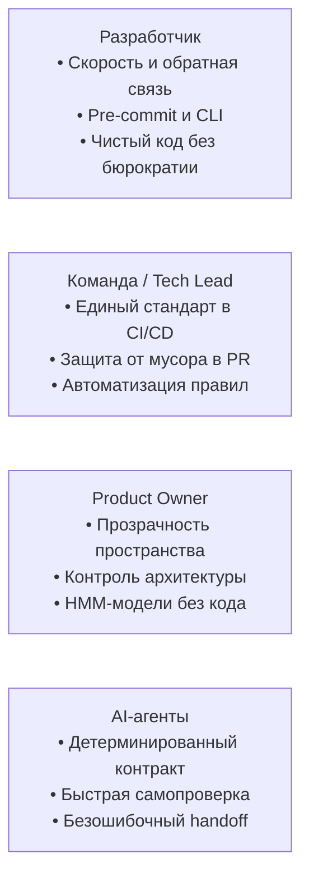
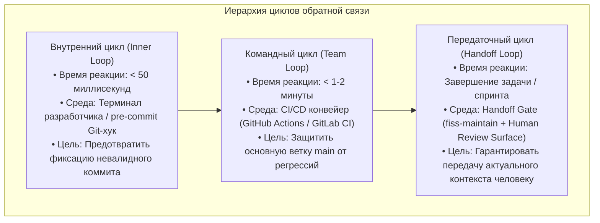

# Продуктовая дорожная карта и циклы обратной связи

Derived from: [Project Workflow](../../knowledge/project/workflow.md), [Semantic Versioning](../../knowledge/project/versioning.md), [README](../../../README.md)

Ментальная модель предназначена для Product Owner и описывает пользовательские персоны, циклы обратной связи и продуктовые горизонты развития инструмента `fiss-lint`.

---

## 1. Профили пользователей и сценарии ценности

`fiss-lint` создавался с прицелом на разнородную аудиторию современного инженерного процесса:

### Сценарии применения:
1. **Индивидуальный разработчик:** Выполняет команду `fiss-lint` в терминале или полагается на Git-хук. При ошибке получает точный файл, строку и понятное описание проблемы.
2. **Команда и Tech Lead:** Интегрируют линтер в GitHub Actions или GitLab CI. Ни один Pull Request не может быть слит, если он ломает ссылочную целостность FISS или вносит недокументированные изменения.
3. **Product Owner:** Имеет структурированное пространство ментальных моделей (`FISS/human/hmm/`), дающее возможность верифицировать соответствие проектных решений бизнес-целям без погружения в технический стек Go.
4. **Автономные AI-агенты:** Линтер служит для агента детерминированным «зеркалом правды». Агент не может завершить задачу, пока `bin/fiss-lint --strict .` не вернёт код `0`.

---

## 2. Циклы обратной связи (Feedback Loops)

Ценность линтера максимизируется за счёт раннего обнаружения дефектов:

Чем ближе цикл к моменту написания документации, тем дешевле исправление: исправление опечатки в ссылке на этапе pre-commit стоит секунды, а поиск потерянного контекста через месяц стоит часы работы команды.

---

## 3. Эволюционные горизонты развития (Product Roadmap)

Развитие `fiss-lint` следует принципам семантического версионирования SemVer 2.0.0 и строится по трём горизонтам:

### Горизонт 1: Фундамент стабильности (Текущий релиз v1.0.x) — Выполнен
- [x] Реализация всех 18 механических правил стандарта FISS v1.0.0 (`FISS-R001`–`FISS-R018`).
- [x] Автономные скрипты установки одной строкой (`curl` для Unix, PowerShell для Windows).
- [x] Кроссплатформенная матричная сборка под Linux, macOS, Windows (amd64, arm64).
- [x] Поддержка машиночитаемого формата вывода `--format json` и флага `--strict`.
- [x] Поддержка официального GitHub-зеркала стандарта (`FISS-R011`).
- [x] Полная двуязычная документация (`README.md` на английском, `README_RU.md` на русском).
- [x] Раздел ментальных моделей человека (`FISS/human/hmm/`) для Product Owner.

### Горизонт 2: Интеграция в инструменты разработки (Релизы v1.1.x – v1.2.x)
- [ ] **Поддержка формата SARIF (Static Analysis Results Interchange Format):** Прямая интеграция диагностических сообщений `fiss-lint` с вкладкой «Security / Code Scanning» на GitHub и GitLab.
- [ ] **Режим расширенной статистики (`--stats`):** Метрики связности пространства (глубина навигационного графа, плотность ссылок, распределение типов документов).
- [ ] **LSP-совместимость / Редакторы:** Легковесный Language Server или расширение для VS Code для подсветки ошибок FISS непосредственно при наборе Markdown-файлов.

### Горизонт 3: Развитие экосистемы FISS (Релизы v2.0.0+)
- [ ] Поддержка будущих версий стандарта FISS при сохранении обратной совместимости с v1.0.0.
- [ ] Оптимизация инкрементального линтинга для сверхбольших пространств (10 000+ документов).
