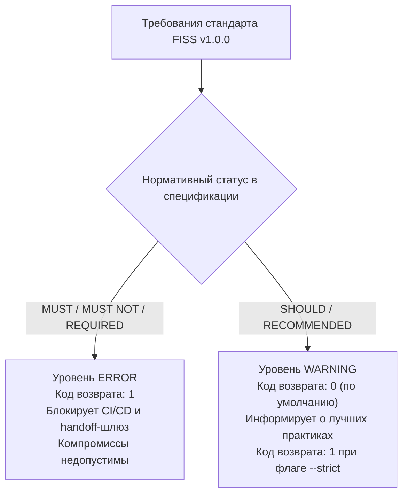

# Модель правил, уровней строгости и детерминированности

Derived from: [Deterministic FISS Rules](../../knowledge/subject/rules.md), [Standard Specification (v1.0.0)](https://fiss.vorozhko.ru/v1.0.0/llms.txt)

Ментальная модель предназначена для Product Owner и объясняет продуктовое и архитектурное обоснование деления правил на уровни строгости, критерии отбора детерминированных проверок и матрицу покрытия стандарта FISS v1.0.0.

---

## 1. Философия уровней строгости: Error vs. Warning

В `fiss-lint` заложена строгая двухуровневая модель диагностики, защищающая проект от двух противоположных крайностей: чрезмерной бюрократии («линтер блокирует работу по любому поводу») и опасного попустительства («линтер пропускает критические нарушения структуры»):

### 1.1. Уровень `Error` (Критические инварианты)
- **Суть:** Нарушение требований, прямо ломающих архитектуру стандарта FISS или делающих пространство нечитаемым для человека или AI-агентов.
- **Примеры:** Отсутствие каталога `FISS/`, отсутствие обязательных файлов `INDEX.md` или `BOOTSTRAP.md`, битые относительные ссылки на несуществующие файлы, файлы-сироты вне навигационного графа, невалидный формат двухстрочных ссылок.
- **Поведение системы:** Выход с кодом `1`. Блокирует коммиты в pre-commit хуках, проваливает пайплайны CI/CD и запрещает перевод handoff-шлюза в состояние `synchronized`.

### 1.2. Уровень `Warning` (Рекомендации качества)
- **Суть:** Отклонение от рекомендуемых стандартом практик, не приводящее к фатальной потере связности пространства.
- **Примеры:** Отсутствие ссылки на официальный сайт стандарта или GitHub-зеркало в `FISS/INDEX.md` (`FISS-R011`).
- **Гибкость для команд (флаг `--strict`):** В режиме повседневной разработки предупреждения не блокируют процесс (код `0`), но при включении флага `--strict` (в релизных конвейерах и production-аудитах) любое предупреждение трактуется как ошибка.

---

## 2. Критерии детерминированности правил

Почему в `fiss-lint` включены именно эти 18 правил, а не сотни других возможных проверок? Линтер руководствуется жесткими критериями детерминированности:

1. **Однозначный предикат истинности:** Результат проверки файла или ссылки обязан быть бинарным: либо условие строго выполняется, либо нет. Эвристики, догадки и вероятностные оценки запрещены.
2. **Отсутствие зависимости от сети (Network-Independence):** Линтер не отправляет HTTP-запросы для проверки внешних сайтов. Это исключает флакающие (flaky) сборки при сетевых сбоях и обеспечивает мгновенную скорость работы в изолированных или закрытых корпоративных контурах.
3. **Повторяемость (Reproducibility):** Набор проверок на одном и том же коммите всегда выдаст 100% идентичный результат на любой операционной системе (Linux, macOS, Windows) и архитектуре процессора.

---

## 3. Матрица покрытия стандарта FISS v1.0.0

Все 18 правил `fiss-lint` сгруппированы по функциональным категориям, отражающим их ценность для защиты интеллектуального пространства:

| Категория | Правило | Уровень | Продуктовая ценность для Product Owner |
| :--- | :--- | :--- | :--- |
| **Корневая топология** | `FISS-R001` | Error | Гарантирует наличие точки входа FISS в репозитории проекта. |
| | `FISS-R002` | Error | Гарантирует наличие обязательных базовых файлов `INDEX.md` и `BOOTSTRAP.md`. |
| **Навигация и условия** | `FISS-R003` | Error | Исключает потерю ссылки на базовый контекст `BOOTSTRAP.md`. |
| | `FISS-R004` | Error | Гарантирует, что `BOOTSTRAP.md` будет прочитан до начала работы над проектом. |
| | `FISS-R005` | Error | Защищает двухстрочный формат навигации и нелокализуемый маркер `Read when:`, гарантируя понимание навигации любыми AI-моделями. |
| **Целостность связей** | `FISS-R006` | Error | Предотвращает появление битых ссылок (404 в локальных файлах) и ссылок на директории без индексов. |
| | `FISS-R007` | Error | Обязывает любую составную область иметь собственный навигационный `INDEX.md`. |
| | `FISS-R008` | Error | Обнаруживает файлы-сироты («мертвые документы»), до которых невозможно добраться по навигационному графу от корня. |
| **Интеграция с агентами** | `FISS-R009` | Error | Защищает правила переопределений: `overrides/INDEX.md` обязан быть прочитан до применения навыков. |
| | `FISS-R010` | Error | Защищает инструкции для AI (`AGENTS.md`), требуя направления агента в FISS без дублирования контекста. |
| **Нормативная база** | `FISS-R011` | Warning | Напоминает о полезности ссылки на официальную спецификацию стандарта FISS. |
| **Чистота структуры** | `FISS-R012` | Error | Запрещает захламление контейнера `FISS/knowledge/` свободными файлами вне `subject/` и `project/`. |
| | `FISS-R013` | Error | Защищает контейнер `FISS/human/`: разрешены только разделы `knowledge/` и `hmm/`. |
| | `FISS-R014` | Error | Требует структурирования реестров состояния (ADR, риски, открытые вопросы) в `FISS/state/`. |
| **Производные знания** | `FISS-R015` | Error | Требует явной маркировки производных знаний маркером `Derived from:` с работающими ссылками на источники. |
| | `FISS-R016` | Error | Обязывает каждый документ ментальных моделей человека (`FISS/human/hmm/`) быть производным от канонических источников. |
| **Чистота политик** | `FISS-R017` | Error | Защищает архитектурную чистоту переопределений: организация по предмету правила, а не по имени инструмента. |
| | `FISS-R018` | Error | Гарантирует валидность записи handoff-шлюза (`synchronized`, `pending`, `unresolved`), защищая непрерывность задач. |
