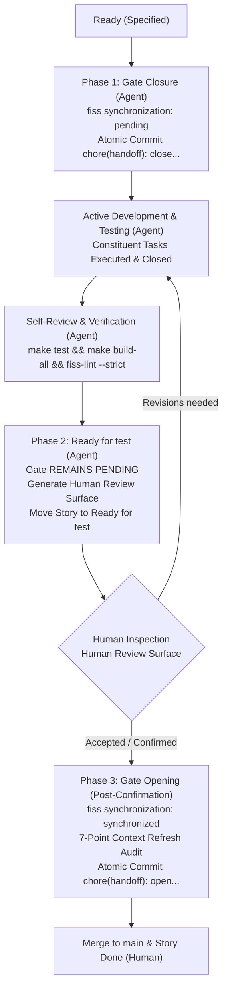

# Handoff Gate Human Confirmation Protocol

This document defines project-specific overrides adapting the behavior of `fiss-maintain`, `fiss-validate`, and the task lifecycle for the `fiss-lint` project.

## Context & Rationale

In `fiss-lint`, tasks require rigorous evidence-based verification and human inspection before the intellectual space transition gate can be considered synchronized. 

Automatically opening the transition gate (`fiss synchronization: synchronized`) at the moment of moving a story to `Ready for test` introduces the risk of premature synchronization:
- If the human reviewer finds defects, discrepancies, or missing evidence during inspection of the `Human Review Surface`, the repository history would already contain an erroneous commit claiming `synchronized` state.
- Therefore, within the `fiss-lint` project, the transition gate MUST NOT be opened automatically by the agent. It MUST remain `pending` throughout the `Ready for test` review stage and MAY be opened only after the human receives the `Human Review Surface`, conducts their independent checks, and provides explicit confirmation of acceptance.

---

## Normative Override Rules

### 1. Two-Phase Protocol with Human Confirmation Gate

The task transition gate follows a strict human-gated two-phase protocol:



---

### 2. Phase 1: Gate Closure on Task Inception (`Ready` → `In progress`)
- **Trigger:** Agent takes the User Story into development.
- **Action:**
  1. Agent creates the feature branch `<type>/story-<id>/<slug>` from `main`.
  2. Agent updates `FISS/state/fiss-handoff.md`:
     ```yaml
     task: <taiga_story_url>
     canonical tracker: https://taiga.vorozhko.ru/
     task status: in_progress
     fiss synchronization: pending
     ```
  3. Agent **immediately authors an atomic Git commit** prior to creating or modifying any codebase files:
     ```bash
     git add FISS/state/fiss-handoff.md
     git commit -m "chore(handoff): close transition gate (fiss synchronization: pending) . T-<task_id>"
     ```
- **Prohibition:** Leaving `fiss synchronization: pending` uncommitted in the working tree across implementation commits is strictly prohibited.

---

### 3. Phase 2: Retention of Closed Gate during Review (`In progress` → `Ready for test`)
- **Trigger:** Completion of all constituent tasks, full test suite pass (`make test`, `make test-install`, `make build-all`), and clean linter run (`bin/fiss-lint --strict .`).
- **Action:**
  1. The transition gate in `FISS/state/fiss-handoff.md` **MUST REMAIN in state `fiss synchronization: pending`**.
  2. The agent generates the **Human Review Surface** adhering to `human-review-surface` (Context, Verified Properties, Verification Gaps, Human Attention Priority, Focused Review Surface, Limitations, Escalation).
  3. The agent presents the Human Review Surface to the user.
  4. The agent transitions the User Story to `Ready for test` in Taiga.
- **Strict Prohibition:**
  > The agent MUST NOT set `fiss synchronization: synchronized` and MUST NOT author an opening transition gate commit while transitioning the story to `Ready for test` or prior to explicit human confirmation.

---

### 4. Phase 3: Gate Opening Strictly Upon Human Confirmation (`Ready for test` → `Done`)
- **Trigger:** The human inspects the Human Review Surface, completes independent verification, and explicitly states their confirmation and acceptance of the task (e.g. «Задачу принимаю», «Принято», «Подтверждаю»).
- **Action (Upon Human Confirmation):**
  1. The agent (or human) conducts the 7-dimension knowledge refresh audit (`subject-knowledge-refresh`, `project-knowledge-refresh`, `adr-maintain`, `risk-register`, `open-questions-maintain`, `glossary-maintain`).
  2. `FISS/state/fiss-handoff.md` is updated:
     ```yaml
     task status: completed
     fiss synchronization: synchronized
     ```
  3. An atomic Git commit is authored opening the transition gate:
     ```bash
     git add FISS/state/fiss-handoff.md
     git commit -m "chore(handoff): open transition gate (fiss synchronization: synchronized)"
     ```
  4. The feature branch is now eligible for push and clean merge into `main`.
  5. The human completes the merge and transitions the User Story in Taiga to `Done` (`status: 25`, `is_closed: true`).

---

### 5. Rework Handling
- If the human requests revisions, identifies defects, or asks for additional evidence:
  - The transition gate remains `fiss synchronization: pending`.
  - The User Story is moved back to `In progress`.
  - Fixes are implemented, fresh verification evidence is captured, and an updated Human Review Surface is submitted for human re-inspection.
